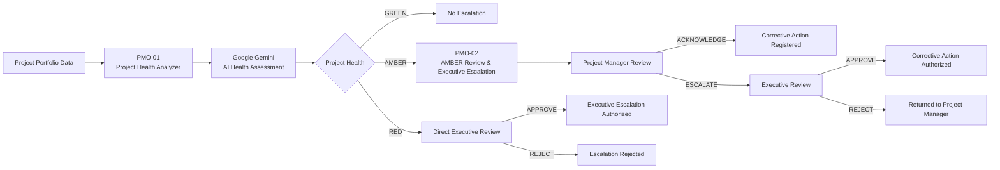

# TOH AI PMO Command Center

> **AI-powered Project Management Office workflow for automated project health assessment, risk-based routing, and human-in-the-loop governance.**

The **TOH AI PMO Command Center** is a portfolio project demonstrating how AI and workflow automation can support an enterprise PMO in identifying project health issues, escalating risks, and coordinating management decisions.

The solution combines **n8n**, **Google Gemini**, structured project data, automated email notifications, and human approval workflows.

It is designed around a simple principle:

> **AI provides analysis and decision support. Human stakeholders retain accountability for management decisions.**

---

## 🎯 Business Problem

Traditional PMO health reporting often depends on manual activities such as:

- reviewing project status reports;
- comparing budget consumption with delivery progress;
- identifying overdue milestones and critical issues;
- checking governance compliance;
- deciding which projects require escalation;
- preparing management notifications;
- following up with Project Managers and Executives.

This creates administrative overhead and can delay intervention on deteriorating projects.

The TOH AI PMO Command Center explores how these activities can be partially automated while keeping critical decisions under human control.

---

## 💡 Solution

The system automatically retrieves portfolio data and evaluates each project across five PMO dimensions:

| Dimension | Assessment |
|---|---|
| Schedule | Milestones, delays and delivery timing |
| Budget | Budget consumption versus project progress |
| Delivery | Overall implementation progress |
| Risk & Issues | Critical issues, risks and resource constraints |
| Governance | Reporting, RAID management and steering compliance |

Google Gemini performs the project-health assessment and returns a structured result containing:

- overall project health;
- health score;
- executive summary;
- dimension-level assessments;
- key findings;
- recommended management actions.

Projects are then automatically routed according to their health classification.

---

# 🏗️ Architecture



The architecture is intentionally modular.

### PMO-01 — Project Health Analyzer

PMO-01 acts as the **AI analysis and orchestration layer**.

It:

1. retrieves project portfolio data;
2. separates individual projects;
3. sends project data to Google Gemini;
4. validates the AI response using a structured output schema;
5. classifies projects as GREEN, AMBER or RED;
6. routes each project to the appropriate governance process.

### PMO-02 — AMBER Review & Executive Escalation

PMO-02 handles the **human governance process for AMBER projects**.

A Project Manager can:

**ACKNOWLEDGE**

The issue is accepted, a corrective action is registered, and the project remains under monitoring.

or

**ESCALATE**

The project is forwarded for Executive Review.

The Executive can then:

**APPROVE** → authorize the corrective action.

**REJECT** → return the issue to the Project Manager for reassessment.

---

# 🚦 Risk-Based Governance Model

| Health | Workflow Response | Human Decision |
|---|---|---|
| 🟢 GREEN | Continue normal monitoring | No escalation required |
| 🟠 AMBER | Project Manager review | Acknowledge or escalate |
| 🔴 RED | Immediate Executive review | Approve or reject escalation |

This design ensures that governance effort is proportional to project risk.

---

# 🤖 AI Decision Support

The AI is instructed to evaluate only the evidence supplied in the project dataset.

It assesses:

- schedule health;
- budget health;
- delivery health;
- risk and issue exposure;
- governance compliance.

The output is constrained by a structured JSON schema so downstream workflow nodes receive predictable data.

Example:

```json
{
  "project_id": "PRJ-003",
  "project_name": "Service Analytics Modernization",
  "overall_health": "AMBER",
  "health_score": 74,
  "executive_summary": "...",
  "dimensions": {
    "schedule": {},
    "budget": {},
    "delivery": {},
    "risk": {},
    "governance": {}
  },
  "key_findings": [],
  "recommended_actions": []
}
```

The AI does **not** independently authorize management actions.

Final escalation and approval decisions remain with the relevant human stakeholder.

---

# 👤 Human-in-the-Loop Governance

A central design principle of the project is maintaining human accountability.

The workflow combines automated AI assessment with explicit approval gates.

For example:

```text
AI detects AMBER project
        ↓
Project Manager reviews assessment
        ↓
ACKNOWLEDGE ──────────────→ Corrective Action Registered

        OR

ESCALATE
        ↓
Executive reviews escalation
        ↓
APPROVE / REJECT
```

Interactive review forms are generated directly by n8n and linked through automated email notifications.

---

# 📧 Automated Stakeholder Communication

The system generates contextual HTML notifications including:

- project name and ID;
- project health classification;
- health score;
- AI executive summary;
- corrective action information;
- Project Manager decision;
- Executive decision;
- workflow status;
- required next action.

Different notification templates are used for AMBER and RED governance processes.

---

# 🧪 Demo Portfolio

The repository includes a fictional portfolio used to demonstrate the workflow.

| Project | Scenario |
|---|---|
| PRJ-001 — ERP Finance Migration | 🔴 RED |
| PRJ-002 — Employee Onboarding Automation | 🟢 GREEN |
| PRJ-003 — Service Analytics Modernization | 🟠 AMBER |

The sample portfolio deliberately contains different project-health conditions so every major routing path can be demonstrated.

---

# ✅ Tested Workflow Scenarios

The current MVP has been tested across the complete governance model:

| Scenario | Result |
|---|---|
| GREEN → No Escalation | ✅ Tested |
| AMBER → PM ACKNOWLEDGE | ✅ Tested |
| AMBER → ESCALATE → Executive APPROVE | ✅ Tested |
| AMBER → ESCALATE → Executive REJECT | ✅ Tested |
| RED → Executive APPROVE | ✅ Tested |
| RED → Executive REJECT | ✅ Tested |

This includes end-to-end execution through AI analysis, routing, email notification, human review forms and downstream decision handling.

---

# 🛠️ Technology Stack

| Technology | Purpose |
|---|---|
| **n8n** | Workflow orchestration and human approval flows |
| **Google Gemini** | AI project-health analysis |
| **Structured Output Parser** | Validation of AI responses |
| **Gmail API / OAuth 2.0** | Automated stakeholder notifications |
| **GitHub** | Version-controlled project assets and portfolio documentation |
| **Docker** | Local n8n runtime environment |
| **JSON** | Portfolio dataset and workflow interchange |

---

# 📂 Repository Structure

```text
toh-ai-pmo-command-center/
│
├── assets/
│   └── screenshots and architecture material
│
├── data/
│   └── projects.json
│
├── prompts/
│   └── AI / PMO prompt documentation
│
├── schemas/
│   └── structured output schemas
│
├── workflows/
│   ├── pmo-01-project-health-analyzer.json
│   └── pmo-02-amber-review-executive-escalation.json
│
└── README.md
```

Workflow exports published in this repository are **sanitized**.

Credentials, OAuth tokens, API keys and environment-specific identifiers are intentionally excluded.

---

# 🔄 PMO-01 Processing Flow

```text
Manual Trigger / Webhook
          │
          ▼
Retrieve Project Portfolio
          │
          ▼
Split Projects
          │
          ▼
AI Project Health Analysis
          │
          ▼
Structured Output Validation
          │
          ▼
       RAG Router
      /    |     \
 GREEN   AMBER    RED
   │       │       │
   │       │       └── Executive Review
   │       │
   │       └── PMO-02
   │             │
   │          PM Review
   │          /      \
   │ ACKNOWLEDGE   ESCALATE
   │                   │
   │             Executive Review
   │
   └── Normal Monitoring
```

---

# 🔐 Security & Repository Hygiene

The public repository does not contain production credentials.

The workflow exports have been sanitized to remove:

- Gmail OAuth credential references;
- Gemini credential references;
- local n8n workflow IDs;
- generated webhook IDs;
- n8n instance identifiers;
- environment-specific metadata.

Anyone importing the workflows must configure their own credentials and environment.

---

# 🚀 Deployment

The current implementation runs in a **local Docker-based n8n environment**.

This is intentional for the portfolio MVP and allows the complete workflow architecture and execution process to be demonstrated directly during technical interviews.

The GitHub repository contains the sanitized workflow definitions and supporting project assets rather than access to the live n8n editor.

---

# 🎓 What This Project Demonstrates

This project was developed as a practical demonstration of capabilities across:

**AI Transformation**
- identifying suitable enterprise processes for AI augmentation;
- combining AI reasoning with deterministic business rules;
- designing responsible human-in-the-loop decision processes.

**IT PMO**
- project health assessment;
- RAG-based governance;
- management escalation;
- executive decision workflows;
- corrective-action tracking.

**Workflow Automation**
- modular workflow architecture;
- API integration;
- conditional routing;
- sub-workflow orchestration;
- approval forms;
- automated communications.

**Solution Architecture**
- separation of orchestration and governance responsibilities;
- structured AI outputs;
- reusable workflow components;
- secure credential handling.

---

# 🗺️ Roadmap

Potential next iterations include:

- PMO decision and execution audit logging;
- persistent project-health history;
- automated trend analysis;
- dynamic stakeholder resolution;
- centralized PMO dashboard;
- portfolio-level executive reporting;
- Jira / project-management platform integration;
- scheduled portfolio health assessments;
- automated monitoring of corrective-action deadlines;
- additional modular workflows for RED governance;
- production deployment and observability.

---

# ⚠️ Portfolio Project

This repository is a **portfolio / proof-of-concept implementation**.

Project names, financial information, project health information, stakeholders and operational scenarios contained in the demonstration dataset are fictional and are used solely to illustrate the solution architecture.

The system is intended to demonstrate AI-enabled PMO workflow design rather than provide a production-ready enterprise PMO platform.

---

## TOH AI PMO Command Center

**AI analyzes.  
Workflows orchestrate.  
Humans decide.**
